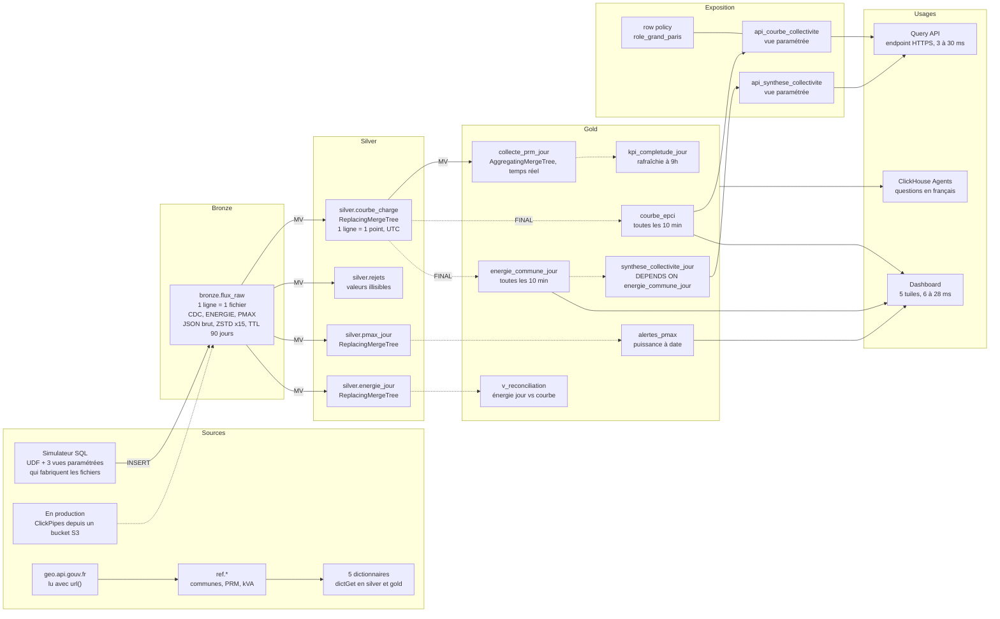

# ClickHouse de zéro à avancé · Workshop Énergie

Une journée de collecte des compteurs communicants d'un distributeur d'électricité, de A à Z, sur **votre propre service ClickHouse Cloud** :
des fichiers JSON au format d'un gestionnaire de réseau (CDC courbes 30 min, ENERGIE énergie jour, PMAX puissance max)
passent en bronze, puis silver, puis gold, jusqu'aux dashboards, à une API et à un agent IA.

Toutes les données sont **simulées en SQL** (aucun fichier client, aucun outil externe) et
déterministes : tout le monde obtient les mêmes chiffres.

```
 JSON CDC/ENERGIE/PMAX ──► bronze ──MV──► silver ──MV / vues rafraîchissables──► gold ──► dashboard
   (simulateur SQL)   1 ligne        1 ligne        agrégats, KPI 9h, alertes        API
                      = 1 fichier    = 1 point                                    agent IA
```

---

## L'architecture du workshop

Chaque flèche est une vue SQL : rien ne tourne en dehors de ClickHouse.
Flèche pleine : vue matérialisée incrémentale, déclenchée à chaque INSERT. Flèche pointillée : vue rafraîchissable, recalculée toutes les 10 minutes à partir des tables silver lues avec FINAL.



| Couche | Objets | Ce qu'il faut retenir |
|---|---|---|
| **Sources** | simulateur SQL (fonctions `sim_*`, 3 vues paramétrées), `geo.api.gouv.fr`, référentiels `ref.*`, 5 dictionnaires | tout est généré en SQL ; en production, ClickPipes lit les fichiers dans un bucket S3 |
| **Bronze** | `bronze.flux_raw` | 1 ligne = 1 fichier JSON brut (CDC, ENERGIE, PMAX), compressé ×15, purgé après 90 jours |
| **Silver** | `courbe_charge`, `rejets`, `pmax_jour`, `energie_jour` | 4 vues matérialisées déplient le JSON à chaque INSERT ; ReplacingMergeTree garde la dernière version |
| **Gold** | `collecte_prm_jour`, `kpi_completude_jour`, `courbe_epci`, `energie_commune_jour`, `synthese_collectivite_jour`, `alertes_pmax`, `v_reconciliation` | 1 vue matérialisée temps réel, 5 vues rafraîchissables (10 min ou 9h), 1 vue simple |
| **Exposition** | `api_courbe_collectivite`, `api_synthese_collectivite`, row policies du rôle `role_grand_paris` | le portail n'envoie que des paramètres ; la sécurité par territoire est dans la base |
| **Usages** | dashboard, Query API endpoint, ClickHouse Agents | tout lit gold, en quelques millisecondes |

Autour du flux principal : la table de 1,5 milliard de points (module 06), le rejeu d'un mois publié par REPLACE PARTITION (module 07), l'observabilité par les tables `system.*`.

Les mots et abréviations de la journée sont dans le [lexique](#lexique).

---

## Avant la session (20 min, à faire la veille)

1. **Créez votre compte ClickHouse Cloud** sur [clickhouse.cloud](https://clickhouse.cloud) avec votre adresse professionnelle. 300 $ de crédits sont offerts pendant 30 jours, largement assez pour la journée.
2. **Créez un service** avec cette configuration, celle du service de test du formateur :

   | Réglage | Valeur | Pourquoi |
   |---|---|---|
   | Région | AWS **eu-central-1** (Francfort) | la même que le service de test |
   | Répliques | **3** | les gros scans se répartissent sur les 3 (module 06) |
   | Mémoire par réplique | **64 Go** (16 vCPU), **minimum = maximum** | taille fixe : pas d'attente d'autoscaling en pleine démo |
   | Mise en veille | **après 1 heure** d'inactivité, au moins | le service ne s'endort pas pendant une pause |

   Coût indicatif : 24 unités de calcul (3 × 64 Go / 8 Go), soit au plus 11 $ de l'heure au tarif public le plus élevé de la région. Une journée de 6 heures reste sous 70 $. Le calculateur de [clickhouse.com/pricing](https://clickhouse.com/pricing) donne le tarif exact.
3. **Notez le mot de passe** de l'utilisateur `default` affiché à la création. Il n'est montré qu'une fois. Gardez-le dans un gestionnaire de mots de passe, jamais dans un fichier du repo.
4. Ouvrez la **console SQL** du service et lancez `SELECT version();`. Si une version s'affiche, vous êtes prêt.
5. Optionnel, pour le rattrapage en ligne de commande : installez le client natif.
   ```bash
   curl https://clickhouse.com/ | sh
   ```

Avec cette configuration, vous retrouverez les durées notées en commentaire (`Mesuré`) dans chaque fichier, ainsi que dans `RESULTATS.md`.

---

## Déroulé (5 h)

| Horaire | Module | Ce qu'on fait | Durée |
|---|---|---|---|
| 0:00 | Introduction | La plateforme : ClickHouse Cloud, stockage et calcul séparés, ClickPipes, Agents | 15 min |
| 0:15 | **00** Premiers pas | De `numbers()` à un fichier d'énergie journalière en JSON, puis 1 million de mesures en une requête | 15 min |
| 0:30 | **01** Fondamentaux | MergeTree, index creux, compression. Les 34 969 communes lues en direct sur geo.api.gouv.fr, 1 million de PRM | 25 min |
| 0:55 | **02** Bronze | Le simulateur de flux de comptage (UDF, vues paramétrées) et 1 800 fichiers JSON bruts, 1,7 Go | 25 min |
| 1:20 | *Pause* | | 10 min |
| 1:30 | **03** Silver | Vues matérialisées, triple ARRAY JOIN, backfill, renvois, corrections, changement d'heure | 35 min |
| 2:05 | **04** Dictionnaires | Référentiels en mémoire, puissance souscrite « à date » | 15 min |
| 2:20 | **05** Gold | MV incrémentale, piège de la somme, vues rafraîchissables, KPI 9h, alertes PMax, réconciliation énergie jour / courbe | 35 min |
| 2:55 | *Pause* | | 10 min |
| 3:05 | **06** Performance | 1,5 milliard de points, index primaire, répliques parallèles, projection, index de saut, cache, SQL avancé | 30 min |
| 3:35 | **07** Exploitation | Rejeu et publication atomique, TTL, DELETE, row policies, observabilité en SQL | 25 min |
| 4:00 | **08** Dashboards, API, Agents | Dashboard de 5 tuiles filtrables, un Query API endpoint sécurisé, ClickHouse Agents : 10 questions et 6 dashboards construits par l'agent | 40 min |
| 4:40 | Conclusion | Ce qu'on a vu, pour aller plus loin, questions | 20 min |

Chaque module a un ou plusieurs fichiers `.sql`, à exécuter **dans l'ordre**. Le README du module 08 détaille les étapes dans la console (dashboard, API, agent).

---

## Dans la console SQL

1. Ouvrez le fichier `.sql` du module sur GitHub, copiez tout, collez-le dans un nouvel onglet de la console.
2. Raccourcis :

| Raccourci (Mac) | Windows / Linux | Effet |
|---|---|---|
| **Cmd + Entrée** | Ctrl + Entrée | Exécute **tout** l'onglet |
| **Cmd + Maj + Entrée** | Ctrl + Maj + Entrée | Exécute la **requête sous le curseur** |

3. Pour suivre pas à pas, placez le curseur dans une requête et utilisez **Cmd + Maj + Entrée**. Les commentaires `À observer` disent quoi regarder (durée, lignes lues, résultat), les commentaires `Mesuré` donnent les chiffres obtenus sur le service de test.
4. Chaque fichier se termine par un **checkpoint** : une ligne de `OK`. Un `KO` veut dire qu'une étape a manqué. Relancez le fichier, il est idempotent (`CREATE OR REPLACE`, `IF NOT EXISTS`).

Bon à savoir :
- La console abandonne une instruction au-delà de **~60 s** (la requête continue côté serveur). Tous les scripts sont découpés pour rester en dessous.
- Un panneau **« Query variables »** s'ouvre sur les vues paramétrées : laissez-le vide et fermez-le.
- Le module 06 insère 1,5 milliard de points en 8 lots d'environ 10 secondes : une instruction par lot pour rester sous la limite de la console.

---

## Rattrapage

Vous avez pris du retard, ou un module a échoué ? Le script `run_all.sh` rejoue les fichiers avec le client natif, depuis votre poste :

```bash
export CH_HOST=<votre-service>.<région>.clickhouse.cloud
export CH_PASSWORD='<mot de passe>'
```

```bash
./run_all.sh 01 04
```
Rejoue du module 01 au module 04 inclus, sans reset. Utile pour rejoindre le groupe.

```bash
./run_all.sh 05_gold
```
Reprend à un module et va jusqu'au bout.

```bash
./run_all.sh
```
Tout depuis zéro, reset compris : environ 4 minutes.

Les résultats détaillés de chaque fichier sont dans `logs/`. Les modules dépendent des précédents : pour reprendre au module 05, les modules 00 à 04 doivent être passés.

`reset.sql` supprime **uniquement** ce que le workshop a créé : les bases `ref`, `bronze`, `silver`, `gold`, `simulateur`, les fonctions `sim_*`, l'utilisateur `dict_reader`, le rôle `role_grand_paris` et ses row policies.

---

## Lexique

Tout ce qui apparaît dans les slides et dans le repo, en une ligne.

| Métier énergie | | ClickHouse | | Plateforme et données | |
|---|---|---|---|---|---|
| **PRM** | Point de référence mesure : identifiant à 14 chiffres d'un compteur | **SQL** | le langage des requêtes, utilisé pour tout le workshop | **JSON** | format texte des fichiers reçus |
| **CDC (flux)** | courbe de charge : puissance moyenne toutes les 30 minutes, en W | **MV** | vue matérialisée : trigger qui transforme chaque INSERT | **API** | interface qu'un programme appelle pour interroger un service |
| **ENERGIE · PMAX** | énergie du jour (Wh) et puissance maximale du jour (VA) | **RMV** | vue rafraîchissable : recalcul complet planifié (10 min, 9h) | **S3 · GCS** | stockage objet d'AWS et de Google Cloud |
| **CONS · PROD** | énergie consommée, et énergie produite (panneaux solaires) | **FINAL** | lit la dernière version de chaque ligne, sans doublons | **CDC (base)** | Change Data Capture : copie continue des modifications d'une base |
| **C5 · C4 · C2** | segments : jusqu'à 36 kVA, de 36 à 250 kVA, raccordé en HTA | **TTL** | durée de vie : purge automatique des lignes trop anciennes | **OTel** | OpenTelemetry : standard de collecte des logs, métriques, traces |
| **RES · PRO · ENT** | profils : résidentiel, professionnel, entreprise | **UDF** | fonction SQL définie par l'utilisateur, réutilisable partout | **MCP** | Model Context Protocol : branche un agent IA sur des outils et des données |
| **EPCI** | intercommunalité (métropole, agglo) : périmètre d'une collectivité | **ASOF JOIN** | jointure sur la valeur la plus proche, par exemple à une date | **KPI** | indicateur clé, par exemple 99 % des données reçues à 9h |
| **INSEE** | code officiel d'une commune, 5 caractères | **ZSTD** | Zstandard : l'algorithme qui compresse les colonnes | **BI** | informatique décisionnelle : tableaux de bord et rapports |
| **VA · W · Wh** | puissance apparente, puissance active, énergie. k, M, G : mille, million, milliard | **UTC** | temps universel, sans changement d'heure : le format de stockage | **RGPD** | règlement européen sur la protection des données personnelles |

---

## Contenu du repo

```
00_introduction/      premiers pas
01_fondamentaux/      bases, MergeTree, référentiels (communes INSEE, PRM)
02_bronze/            simulateur de flux de comptage, ingestion des JSON
03_silver/            vues matérialisées, doublons, corrections, changement d'heure
04_dictionnaires/     enrichissement en mémoire
05_gold/              agrégats, vues rafraîchissables, KPI 9h, alertes, réconciliation
06_performance/       1,5 milliard de points, optimisations mesurées
07_exploitation/      rejeu, TTL, sécurité, observabilité
08_dashboards_agent/  README pas à pas : dashboard, API, ClickHouse Agents (aucun fichier SQL)
data/                 référentiels INSEE de secours (si geo.api.gouv.fr ne répond pas)
run_all.sh, reset.sql exécution complète et nettoyage
RESULTATS.md          chiffres mesurés sur le service de test, module par module
```

## Bonnes pratiques ClickHouse illustrées

| Règle | Où |
|---|---|
| ORDER BY du moins au plus cardinal, filtres sur le préfixe de la clé | 01, 03, 06, 08 |
| `LowCardinality` sous 10 000 valeurs distinctes, pas de `Nullable` | 01, 03, 05 |
| Partitions bornées (une par mois), utilisées pour le cycle de vie | 02, 03, 07 |
| Gros lots à l'insertion | 02, 03, 06 |
| Répartir un scan sur les répliques (séparation stockage/calcul) | 06 |
| MV incrémentales pour les agrégats idempotents (`uniqExact`, `min`, `max`) | 03, 05 |
| Vues rafraîchissables pour les sommes et les jointures | 05 |
| Dictionnaires plutôt que des JOIN répétés | 04, 05, 06, 08 |
| Pas d'`OPTIMIZE … FINAL`, pas d'`ALTER UPDATE` en usage courant | 03, 07 |
| Schéma documenté et requêtes bornées pour les agents | 08 |
